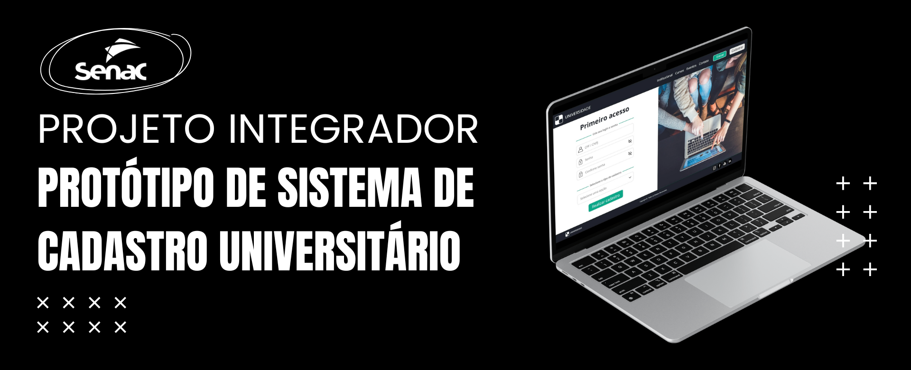

## Descrição do Projeto
Este projeto contém os protótipos de interface para um sistema de cadastro universitário, desenvolvido com base nos diagramas de caso de uso da fase inicial do projeto.
As jornadas de usuários incluem o cadastro de **Pessoa Física**, **Pessoa Jurídica**, **Professores**, **Fornecedores** e **Alunos**. Todos os protótipos estão documentados e organizados no formato **Markdown**, conforme os requisitos do projeto.

---

## 🔍 **Cadastro**

| **Cadastro**         | **Status** |
|----------------------|------------|
| 🌐 **Pessoa Física**  | ✔️ **Concluído**   |
| 🏢 **Pessoa Jurídica**| ✔️ **Concluído**   |
| 👨‍🏫 **Professores**  | ✔️ **Concluído**   |
| 🧑‍🎓 **Alunos**       | ✔️ **Concluído**   |
| 🛒 **Fornecedores**   | ✔️ **Concluído**   |

---

### 📝 Telas de Cadastro

---

## Referências 🛠️

1. OLIVEIRA, Henrique Pontes Gonçalves de. Ferramentas de desenvolvimento – diagrama de caso de uso. In: OLIVEIRA, Henrique Pontes Gonçalves de. Análise de sistemas. São Paulo: Editora Senac São Paulo, 2019. (Série Universitária). p. 145-148

2. O que é UML e diagramas de caso de uso: introdução prática à UML. DEVMEDIA, 2012. Disponível em: <https://www.devmedia.com.br/o-que-e-uml-e-diagramas-de-caso-de-uso-introducao-pratica-a-uml/23408>. Acesso em: 22 set. 2024.

---

## Desenvolvido por: ✍️

 
<table>
  <tbody>
    <tr>
      <td align="center" valign="top" width="14.28%"><a href="https://github.com/bvianas"> <b>Bianca Viana</b></a> 
      </td>
      <td align="center" valign="top" width="14.28%"><a href="https://github.com/CarolineDidone"> <b>Caroline Didone</b></a> 
      </td>
      <td align="center" valign="top" width="14.28%"><a href="https://github.com/lilianecardeal"> <b>Liliane Cardeal</b></a> 
      </td>
      <td align="center" valign="top" width="14.28%"><a href="https://github.com/larissacara"> <b>Larissa Cara</b></a> 
      </td>
      <td align="center" valign="top" width="14.28%"><a href="https://github.com/Kawanamartins"> <b>Kawana Martins</b></a> 
      </td>
    </tr>
  </tdbody>
</table>
